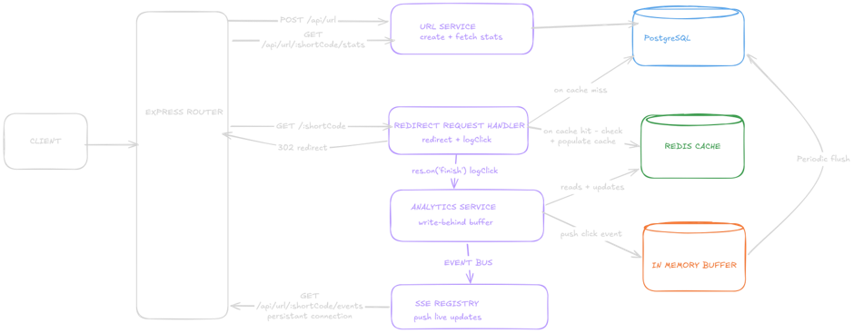

# SnapTrace — Architecture

A URL shortener with real-time click analytics, built around difficult concepts: a write-behind buffer for click counts, a Server-Sent Events (SSE) layer for pushing live updates, and a pub/sub boundary that keeps the two decoupled.

For the project narrative – why this was built, and what went wrong along the way – see README.md

## The non-trivial parts

Three concepts that made the build difficult:

- **The write-behind buffer.** Click counts can't be written to PostgreSQL on every redirect without harming redirect latency. Clicks accumulate in memory and flush to the database in batches. This is acceptable for click data — it's loss-tolerant — but the same approach is never used for URL creation, where losing a short-code mapping is unacceptable.
- **Real-time updates via SSE.** A click count is a value that changes after the page has already loaded. Server-Sent Events were used to push updated counts to the browser without polling, which required building a registry to hold open HTTP Response objects beyond the lifetime of the request handler that created them.
- **Decoupling the two.** The analytics service and the SSE layer don't import each other. They communicate through a shared EventEmitter, following the publish/subscribe pattern. This means either side can change — or be replaced entirely — without touching the other.

## Tech stack and why

- **PostgreSQL over NoSQL** because the database schema is the source of truth, and Prisma generates TypeScript types from that schema — not the other way around. A relational DB maintains referential integrity, which matters here: a click row references a URL row, and that relationship needs to be enforced, not assumed.
- **Redis** – used for two distinct things: cache-aside reads on the redirect path (sub-millisecond RAM-based lookup compared to PostgreSQL's disk-backed reads), and as the source of the last-confirmed click count for the optimistic update calculation.
- **Prisma** – type-safe queries generated from schema.prisma. Caught real bugs during this build – see below.
- **TypeScript** – caught two specific runtime bugs at compile time during this build:
  - `clickCount` was used in a destructured object literal before being destructured from the return value of `getUrlStats` – TypeScript errored "cannot find name," where plain JavaScript would have thrown a ReferenceError only when a cache-miss path executed in production.
  - Separating the database-shape type (`ClickEvent`) from the function-parameter type (`LogClickParams`) caught call sites that weren't updated when `logClick`'s signature changed.
- **Server-Sent Events** – see design decisions section.
- **Vanilla JS for frontend** – no framework needed for a small, mostly form-driven UI. Kept the EventSource lifecycle code explicit rather than hidden behind a library abstraction – the point of this build was understanding the mechanism.


## API endpoints

- `GET /api/urls/:shortCode/stats` – get stats information
- `GET /api/urls/:shortCode/events` – SSE event stream for click count
- `POST /api/urls` – create URL endpoint
- `GET /:shortCode` – the redirect endpoint
- `GET /api/health` – observability health check

## High level system design




# System flows

## URL creation

1. In `app.js` – user submits form
2. In `api.js` – POST `/api/urls` fetch with `{longUrl, expiresAt}` body
3. In `app.ts` – `express.json()` parses the body and `cors()` adds headers
4. `url.routes.ts` – matches POST `/`, calls `validateBody` middleware then `createUrlRequest` controller
5. `controllers/url.controller.ts` (`createUrlRequest`) – extracts `req.body`, calls `createUrl` service
6. `services/url.service.ts` (`createUrl`) – `validateExpiry`, loop `generateShortCode`, calls `prisma.urls.create`
7. `utils/base62.ts` – `generateShortCode`
8. `config/db.ts` – Prisma client executes INSERT
9. PostgreSQL – inserts row, enforces unique constraint. P2002 caught → retry
10. Response: service returns `urlResponse` → controller sends 201 JSON → `api.js` receives data → `app.js` stores shortCode, opens EventSource

**What I learnt building `createUrl` in `url.service.ts`:** short codes are generated and inserted optimistically – INSERT, catch P2002 on collision, retry – rather than checking for existence first and inserting second. Checking-then-inserting leaves a window between the check and the insert in which another process could insert the same code: a Time-Of-Check-to-Time-Of-Use (TOCTOU) race. Letting PostgreSQL's unique constraint enforce uniqueness collapses the check and the insert into a single atomic operation, eliminating that window entirely.


## Click → real-time update

### Cache hit

1. Browser `GET /:shortCode`
2. `redirect.routes.ts` – `validateShortCodeParam` middleware
3. `controllers/redirect.controller.ts` – `getCachedUrl(shortCode)`
4. `services/cache.service.ts` – `redis.get(...)` returns cached URL
5. `res.on('finish', () => logClick({ urlId, ipAddress, shortCode, longUrl, expiresAt }))` registered. `res.redirect(longUrl)`
6. User lands on the destination (original URL)
7. `finish` fires: `services/analytics.service.ts` `logClick`
8. `clickBuffer.push(...)`, `clickBufferMap.set(shortCode, count + 1)`
9. `getCachedUrl.then(cached => { total = cached.clickCount + bufferCount })` – the optimistic total
10. `events/eventBus.ts` `eventEmitter.emit('click', shortCode, { shortCode, clickCount: total, longUrl, expiresAt })`
11. `sse/sse.registry.ts` – `click` listener fires, looks up `connections.get(shortCode)`, and writes the formatted payload to every Response in that set via `forEach res.write(formatSseData(payload))`
12. Browser `EventSource.onmessage` – `JSON.parse(e.data)`, `showStats({ ...res, createdAt: data.createdAt })` updates the UI

### Cache miss

Steps 3–4 differ: `getCachedUrl` returns null → `controllers/redirect.controller.ts` calls `services/url.service.ts` `getUrl(shortCode)` → `config/db.ts` `prisma.urls.findUnique` → `services/cache.service.ts` `setCachedUrl(shortCode, longUrl, urlId, expiresAt, 0)` populates the cache with clickCount 0 (fire and forget). The flow then continues from step 5 onward, identical to the cache-hit path.


## Flush cycle

The periodic flush has two buffer structures, `clickBuffer` and `clickBufferMap`. `clickBuffer` mirrors the DB schema, ready for `prisma.clicks.createMany()`. `clickBufferMap` tracks count per shortCode for O(1) lookup when building the optimistic total in `logClick`. Merging into one array would require an O(n) filter – they're separate because they serve different purposes. Both are snapshotted and cleared together, atomically.

`logClick`'s purpose is to provide immediate user feedback to the client by returning the optimistic count state. `logClick` is synchronous at the call site – it returns immediately after the buffer operations, so it never needs to be awaited. The Redis read is the background work: it's detached into a `.then` chain that fires asynchronously after the function has already returned. The core reasoning for this is that `logClick` is called inside `res.on('finish')`, which is a fire-and-forget callback. If this were an async function, a promise would be returned that nothing awaits, and any errors inside it would be silent. The buffer operations – the push and the map increment – must happen synchronously so they complete before the function returns. In `logClick` this is our first emit, showing the client the optimistic update.

On flush we snapshot both buffers immediately, because new clicks can arrive while the flush is in progress – clearing the buffers right away means those new clicks land safely in the fresh buffers instead of being lost. The snapshot is inserted into the Clicks table. We then get the real DB count and update the cache accordingly – this triggers the second emit, now carrying the confirmed total. The flush is an asynchronous process, and the DB eventually catches up. The client receives both: it shows the optimistic value immediately, then silently corrects to the confirmed value when the flush fires.


# Design decisions

## Write-behind analytics

The click analytics uses the write-behind pattern: an in-memory buffer, then flushing to DB, then updating the Redis cache.

- **Why:** avoid N DB writes per redirect.
- **Tradeoff:** clicks lost on server restart.
- **Why acceptable:** analytics is loss-tolerant, URL creation is not — different data, different guarantees.

## Why the SSE registry exists

The registry's Map holds a strong reference to the `res` object. As long as that reference exists in a module-level Map, the JavaScript GC cannot collect it – that is the definition of a strong reference. The `res` object outlives the handler because the Map is module-level and persists for the server's lifetime. The open TCP connection also keeps `res` alive. When `req.on('close')` fires and `sseRegistry.remove()` deletes the Map entry, the last strong reference is released and the GC can collect the `res` object. Anything that later calls `sseRegistry.emit(shortCode, payload)` looks up the Map, finds the `res`, and calls `res.write()`.

## SSE over WebSockets

WebSocket would be over-engineering here. SSE is unidirectional – click counts only flow server to client. It requires no protocol upgrade and EventSource auto-reconnects natively, unlike WebSockets which need custom reconnection logic.

- **Tradeoff:** unidirectional only, HTTP/1.1 connection limit.

## Pub/sub via EventEmitter

The pub/sub pattern is a decoupling strategy for event-driven architecture. This is different from direct calls because both are decoupled via an intermediary (event bus). Publishers publish when data changes, subscribers subscribe to the event. Publishers fire and forget. Subscribers register to consume matching messages. Analytics publishes, registry subscribes. This is because the publisher must be the module that is closest to the event's origin. A click happens in the redirect controller, which calls `logClick` in the analytics service. Analytics is the first module that knows a click occurred. The registry has no way to detect clicks – it only holds Response objects. It has no connection to the redirect path. The data flows: redirect → analytics → eventBus → registry. Reversing it would mean the registry would need to be imported into the redirect path, which violates separation of concerns and would require the registry to know about HTTP requests.

The `eventBus.ts` lives in its own dedicated folder `events` rather than inside the `analytics.service.ts` or `sse.registry.ts` because we want to avoid a circular dependency. If `eventBus` lived in `analytics.service.ts`, `sse.registry.ts` would import analytics to subscribe – A imports B imports A. If it lived in `sse.registry.ts`, analytics would import the registry – same problem. A dedicated module with no imports breaks the cycle cleanly. Both analytics and registry import from it; neither imports from each other. The same principle behind Prisma living in `src/config/db.ts` – shared infrastructure with no application dependencies. 

## Cache-aside reads

Cache-aside is a read optimisation strategy, also known as lazy loading. The application checks the cache first – cache hit returns immediately. Cache miss fetches from DB, stores in cache, and returns. This is performant for read-heavy operations. This pattern appears in two places:

- The redirect controller – `getCachedUrl(shortCode)` on `GET /:shortCode`. Cache hit returns `longUrl` immediately for the redirect.
- The events route – `getCachedUrl(shortCode)` when opening an SSE connection for the initial state.

Both follow the same check-Redis → fallback-to-DB → populate-cache pattern.

Redirect controller uses `getUrl` on cache miss. Events route uses `getUrlStats` on cache miss. The reason for this is that query cost differs by use case. The redirect path needs to be as fast as possible – the user is waiting to land. `getUrl` is a simple `findUnique` with no joins. `getUrlStats` does a join on the clicks table (`_count`) which is more expensive. The redirect only needs `longUrl` to redirect; it does not need `clickCount`. There's also a UX reason on the events route: sending `clickCount` 0 when the URL already has 47 clicks may cause the UI to jump from 0 to 48 on the next click. `getUrlStats` gets the real count, fresh from the DB. The extra join cost on the SSE cold path is acceptable since cache misses are rare after first visit.

## Optimistic updates

An optimistic update shows the expected result of an operation before the server confirms it. In SnapTrace, when a click fires, we know the count will increment by 1. Instead of waiting for the DB write to complete, we immediately emit `cachedCount + bufferCount` to the SSE clients. The UI shows the increment instantly. If the estimate is wrong (due to race conditions or drift), the second emit from flush corrects it. When flush runs: `prisma.clicks.count()` returns the real DB total, and `setCachedUrl` updates Redis with the confirmed count. Optimistic update is appropriate here since the staleness window is acceptable and the operation almost always succeeds.

- **First emit:** `cachedCount + bufferCount` — immediate, in `logClick`.
- **Second emit:** DB-confirmed — corrects drift, in the flush.

## Layered Architecture

The file structure follows the MVC architecture (Model, View Controller) which follows routes → controllers → service → config, with dependencies flowing in one direction only. Routes call controllers. Controllers call services. Services call config (DB, Redis clients). Nothing in config or services ever imports a controller or route – the dependency never flows back up.

Each layer has exactly one responsibility: routes map URLs to controllers, controllers handle the HTTP layer (req/res, status codes), the services own the business logic and decide which data layer to call, config holds the singleton clients everything else reads from. For example `redirect.controller.ts` is the orchestrator deciding hit or miss, while `cache.service.ts` and `url.service.ts` each know about exactly one store and nothing else.

This matters because it's what makes each layer testable and replaceable in isolation. A service can be unit tested without spinning up Express. A route can be repointed at different controller without touching the service underneath it. Breaking the rule – a Prisma query inside a route file, for example – collapses that isolation and makes every layer depend on the specifics of every other layer.

## File structure

```
src/
  events/eventBus.ts              — shared EventEmitter, no deps
  sse/sse.registry.ts             — factory, private Map, pub/sub subscriber
  sse/sse.utils.ts                — SSE wire format helpers
  routes/events.routes.ts         — SSE endpoint, connection lifecycle
  services/analytics.service.ts   — write-behind, two buffers, flush
  services/cache.service.ts       — Redis cache-aside reads/writes
  controllers/redirect.controller.ts  — res.on('finish') pattern
  server.ts                       — flush interval, graceful shutdown
```

## What breaks at 10x scale

- EventEmitter is process-local — each server instance has its own, unconnected to the others → Redis Pub/Sub
- In-memory buffer is process-local — would need to move to a Redis List or queue → dedicated flush worker
- Module-level singletons hold per-process, not per-fleet → shared infrastructure

## Next steps – beyond process boundary – database-per-service

Redis and PostgreSQL have no direct connection. The `redirect.controller.ts` is the orchestrator: it decides hit or miss and calls `cache.service.ts` or `url.service.ts` accordingly, each of which only knows about its own store. This uses the repository-pattern split which works for a single deployment.

The next step at real scale isn't changing that relationship – it's extracting the whole bundle (controller + both services) into its own deployable service with own API, so nothing outside it ever needs to know cache-aside is happening at all. Other services would call a url-lookup service over the network and never see Redis or PostgreSQL directly – database per service, one of the core microservices patterns. The cache/DB relationship inside it stays identical; what moves is the boundary of who's allowed to touch them.
